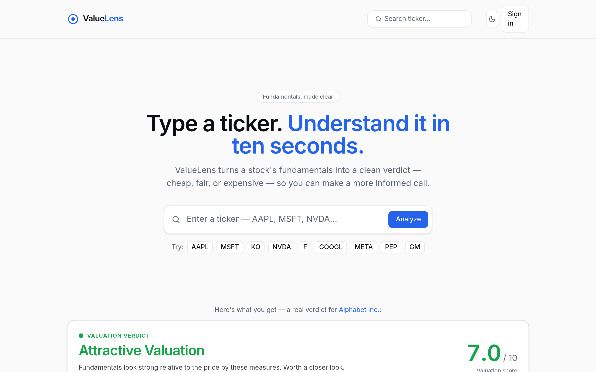

<div align="center">

# 🔎 ValueLens

### Type a ticker. Understand it in ten seconds.

ValueLens turns a stock ticker into a clean valuation verdict — **cheap, fair, or expensive** — based on fundamentals. A clarity layer over public data, not financial advice.

[**🌐 Live demo →**](https://valuelens-gray.vercel.app)

[](https://nextjs.org)
[](https://www.typescriptlang.org)
[](https://tailwindcss.com)
[](https://supabase.com)
[](./LICENSE)



</div>

---

## What it does

Enter a stock ticker and instantly get a **valuation dashboard**:

- **Key metrics** — valuation (P/E, P/B, P/S, EV/EBITDA), growth, and profitability, clearly grouped
- **A 0–10 valuation score** from a transparent, auditable engine
- **A plain-English verdict** that explains *why*
- **Peer comparison** — see the stock against its sector, because valuation is relative
- **Accounts** (optional) — sign in to build a watchlist and save analyses

It works out of the box with **no API key** (bundled demo data), and progressively
lights up as you add a stock-data key and a Supabase project.

See [`PROJECT_PLAN.md`](./PROJECT_PLAN.md) for the full product blueprint.

## Stack

- **Next.js 16** (App Router) · **TypeScript** · **Tailwind CSS v4**
- **Financial Modeling Prep** for fundamentals (with a bundled demo fallback)
- **Supabase** (Postgres + Auth) for accounts — optional
- Deployed on **Vercel**

## Getting started

```bash
npm install
npm run dev
```

Open http://localhost:3000. It runs immediately in **demo mode** (sample data for
`AAPL`, `MSFT`, `NVDA`, `GOOGL`, `META`, `KO`, `PEP`, `F`, `GM`) — no key required.

### Live data (optional)

Get a free key at [financialmodelingprep.com](https://financialmodelingprep.com), then:

```bash
cp .env.example .env.local
# set FMP_API_KEY=your_key in .env.local
```

The key is read **server-side only** (in `services/stockProvider.ts` and the
`/api/stock/[ticker]` route) and never reaches the browser.

### Accounts (optional)

Set `NEXT_PUBLIC_SUPABASE_URL` and `NEXT_PUBLIC_SUPABASE_ANON_KEY` and follow
[`db/README.md`](./db/README.md) (create a project, run `db/schema.sql` then
`db/policies.sql`). With these unset, all auth UI stays hidden and the app behaves
like the keyless MVP.

## Architecture

```
app/                       Routes & pages
  page.tsx                 Landing (hero + search + live example)
  stock/[ticker]/          The valuation dashboard
  watchlist/ , saved/      Account pages
  login/ , auth/callback/  Auth entry + OAuth/email callback
  actions/account.ts       Server actions: watchlist toggle, save, sign out
  api/stock/[ticker]/      Server-side data fetch (hides the API key)
components/
  ui/                      Primitives: Card, Button, Tooltip, Skeleton
  layout/                  Header, Footer, Logo, ThemeToggle, UserMenu
  search/ , auth/          SearchBar, AuthForm
  dashboard/               CompanyHeader, VerdictCard, MetricCard, MetricGroup,
                           ScoreBreakdown, VerdictBadge, SaveActions, PeerComparison
lib/
  valuation/               Pure scoring engine (engine, thresholds, verdict)
  sectorContext.ts         Sector-relative metric context
  presentMetrics.ts        Fundamentals -> display metric groups
services/
  stockProvider.ts         FMP provider + demo fallback
  normalize.ts , demoData  Response normalizer, bundled demo set
  peers.ts                 Sector peer lookup
  supabase/                Browser/server clients, session proxy, queries, config
db/                        schema.sql, policies.sql, setup README
types/                     Provider-agnostic shared types (incl. db.ts)
utils/                     Formatting & class-name helpers
proxy.ts                   Refreshes the Supabase session per request
```

The **valuation engine** (`lib/valuation/`) is pure and I/O-free — it takes
normalized `Fundamentals` and returns a score + breakdown, so it's trivially
testable and decoupled from whichever API supplies the numbers.

**Security model:** every Supabase table has **Row Level Security** so users only
ever access their own rows. The anon key is public by design; RLS protects the
data. Server actions re-derive values server-side (e.g. re-scoring on save)
rather than trusting client input.

## The scoring model

Four weighted categories produce a 0–10 score:

| Category | Weight | Metrics |
|---|---|---|
| Valuation | 40% | P/E, P/B, P/S, EV/EBITDA |
| Growth | 25% | Revenue & earnings growth |
| Profitability | 25% | Net margin, ROE, ROA |
| Financial Health | 10% | Debt / equity |

| Score | Verdict |
|---|---|
| 0–3 | Expensive |
| 4–6 | Fairly Valued |
| 7–10 | Attractive Valuation |

Metrics that can't be computed (e.g. P/E for a loss-making company) are excluded
and disclosed. The full breakdown is shown in the dashboard.

## Not financial advice

ValueLens scores fundamentals only — it doesn't account for guidance, management,
moat, or macro conditions. It's a starting point for research, not a
recommendation to buy or sell. A lens, not a crystal ball.

## License

[MIT](./LICENSE) © xuan-robotix
